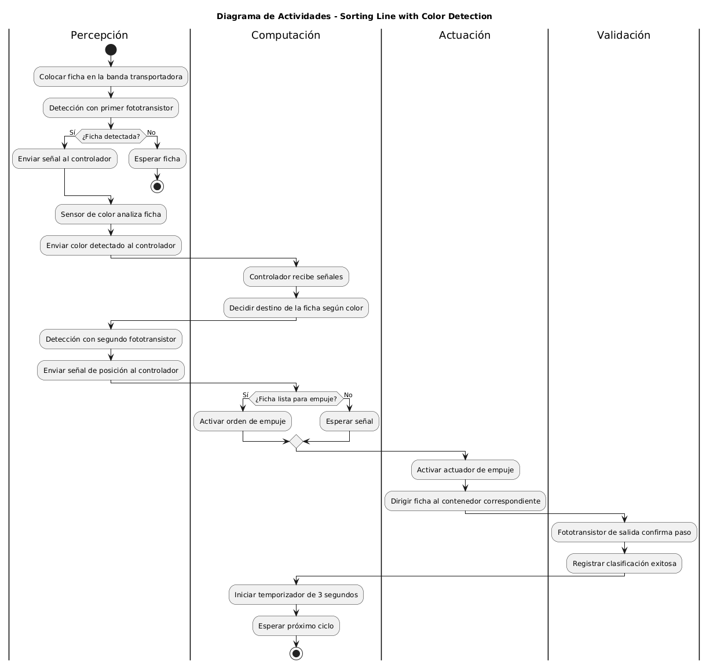

# Sorting-Color-machine
## 1. Resumen General

### Motivación
En la actualidad, los sistemas de manufactura enfrentan la necesidad de aumentar su productividad, flexibilidad y precisión, manteniendo bajos costos y garantizando la calidad del producto [1]. La clasificación automática de piezas según atributos como el color es un proceso fundamental en múltiples industrias (alimentaria, farmacéutica, reciclaje, electrónica, etc.), donde la velocidad y confiabilidad de la separación impactan directamente en la eficiencia de la línea de producción [2].
La incorporación de tecnologías de Internet Industrial de las Cosas (IIoT) permite no solo automatizar la clasificación, sino también monitorear y recopilar datos en tiempo real, posibilitando análisis de desempeño, mantenimiento predictivo y escalabilidad del proceso [3].

### Justificación
El proyecto busca desarrollar un prototipo funcional de línea de clasificación de piezas por color, utilizando el kit Sorting Line with Color Detection 24V de Fischertechnik, con el fin de poder representar de forma práctica un proceso de control industrial real, integrar los principios de percepción (sensores), actuación (actuadores), computación (controlador) y conectividad propios del IIoT.
En la vida real serviria para hacer procesos de clasificación automática que son ampliamente utilizados en:
- Industria alimentaria: clasificación de frutas, vegetales o granos según color, maduración o defectos.
- Industria farmacéutica: separación de pastillas o cápsulas defectuosas.
- Industria de reciclaje: clasificación de plásticos, vidrios o metales según color para facilitar su reprocesamiento.
- Líneas de ensamblaje: control de calidad y separación de componentes en función de su acabado o características visuales.

Con el fin de justificar el proyecto se revisaron trabajos recientes sobre automatización e IIoT aplicados a clasificación e inspección industrial. En las siguientes tablas se resumen las tecnologías empleadas, la arquitectura y los beneficios principales, que sirven de referencia para el diseño del prototipo [4] [5] [6].

| **Nombre** | **Problema** | **Tecnologías IoT usadas** | **Arquitectura** | **Beneficios** |
|------------|-------------|---------------------------------------|--------------------------------------------|----------------|
| Sistema IoT ultrasónico-visión para clasificación automática de frutas | Clasificación ineficiente y costosa de frutas por tamaño y color en la agricultura tradicional | **Computación:** Raspberry Pi 3 con Raspbian, Python y OpenCV **Percepción:** cámara ojo de pez Arducam OV5647, sensores ultrasónicos HY-SRF05, motor servo **Conectividad:** protocolo MQTT, I2C, GPIO, Wi-Fi/Bluetooth | Arquitectura modular con Raspberry Pi como unidad central que recibe datos de cámara y sensores ultrasónicos. Procesa imágenes con OpenCV y aplica técnicas de machine learning para reconocer tamaño y color. Controla motor servo y cinta transportadora para dirigir frutas a bandejas configurables. Comunicación mediante MQTT y pantalla OLED para visualización. | – Clasificación con precisión del 90% en tiempo real – Reducción de mano de obra y costos – Escalabilidad a más bandejas o nuevos productos – Seguimiento y mantenimiento predictivo – Aumento de productividad y consistencia en calidad |
| Sistema automatizado de control de calidad para latas de atún | Detección y clasificación de defectos en latas metálicas (sellado, etiqueta, anillo easy-open) | **Computación:** Raspberry Pi 4, entrenamiento de modelos en Google Colab con GPU (YOLOv5x, EasyOCR). **Percepción:** Cámara Raspberry HQ, sensores fotoeléctricos, algoritmos de visión artificial. **Conectividad:** Integración con IoT usando Mosquitto (MQTT), Node-RED, InfluxDB, Grafana. | El sistema transporta latas por una banda controlada por Arduino; la cámara captura imágenes y el modelo YOLOv5x detecta defectos; OCR extrae datos de etiquetas; los resultados se transmiten mediante MQTT y se visualizan con Grafana; un brazo robótico clasifica las latas en contenedores según su condición. | - Inspección en tiempo real con alta precisión (>95%). - Reducción de errores humanos en control de calidad. - Optimización de recursos y tiempos de producción. - Liberación de operadores para otras tareas. - Registro y trazabilidad de datos de producción. |
| Sistema automático de clasificación por color basado en PLC, TIA Portal y Factory I/O | La clasificación manual por color es lenta, costosa y propensa a errores en procesos industriales de gran escala. | **Computación:** PLC Siemens CPU 1511-1 PN, software TIA Portal y Factory I/O (simulación y programación), SCADA y HMI para monitoreo. **Percepción:** sensores de color (0–10 V). **Conectividad:** PROFINET para comunicación entre dispositivos. | Dos bandas transportadoras (4 m y 2 m), tres sensores de color, tres empujadores neumáticos, cuatro chutes para objetos clasificados/no clasificados, botones de emergencia/reset/stop, sistema SCADA-HMI para supervisión y control. | Clasificación precisa y rápida (250 objetos en 20 min con alta fiabilidad), reducción de errores humanos, menor costo operativo, adaptable a distintas industrias (minería, reciclaje, granos), fácil expansión para detectar más colores u otras características. |

### Objetivos del proyecto
#### Objetivo general
Diseñar, desarrollar, implementar y validar un prototipo automatizado de línea de clasificación de piezas por color, basado en principios de IIoT y utilizando el kit Fischertechnik Sorting Line with Color Detection 24V.
#### Objetivo especifico
- Identificar el proceso de control industrial y justificar su necesidad de automatización mediante revisión de antecedentes.
- Levantar y documentar las restricciones de diseño (técnicas, económicas, regulatorias, temporales y de escalabilidad).
- Diseñar la arquitectura de hardware y software que integre sensores, actuadores, controlador y conectividad.
- Implementar el prototipo físico en base al diseño establecido.
- Validar el funcionamiento mediante un protocolo de pruebas experimentales, evaluando desempeño y confiabilidad.
- Documentar los resultados obtenidos y proponer mejoras o líneas de trabajo futuro.

### Estructura de la documentación
- Resumen general: motivación, justificación, objetivos y estructura.
- Solución propuesta: restricciones de diseño, arquitectura planteada, desarrollo modular y estándares aplicados.
- Configuración experimental, resultados y análisis: entorno de pruebas, datos obtenidos y evaluación del desempeño.
- Autoevaluación del protocolo de pruebas: análisis crítico de la metodología empleada.
- Conclusiones y trabajo futuro: retos, aprendizajes y proyección del proyecto.Anexos: código fuente, esquemáticos y material complementario.

### Proceso seleccionado
El proceso industrial seleccionado corresponde a una línea de clasificación de piezas por color (Sorting Line with Color Detection 24V), desarrollada con los kits de Fischertechnik \[8]. Este sistema reproduce de manera práctica y didáctica un proceso típico de automatización empleado en la industria manufacturera, donde resulta necesario clasificar objetos en función de sus propiedades físicas detectadas mediante sensores. La implementación de este tipo de líneas permite ilustrar cómo interactúan distintos elementos —sensores, actuadores, controladores y sistemas de transporte— para lograr la separación automática de piezas según criterios predefinidos, reflejando en pequeña escala el funcionamiento real de sistemas industriales más complejos.

### Relevancia del proceso

Este proceso de clasificación es fundamental porque:
- Aumenta la eficiencia al reducir el tiempo y la intervención manual.
- Mejora la calidad mediante una inspección y separación más precisa.
- Escala fácilmente a diferentes volúmenes de producción.
- Reduce costos operativos asociados a errores humanos y reprocesamiento.
- Integra principios de IIoT, ya que los datos capturados por sensores pueden enviarse a la nube o sistemas SCADA para monitoreo, análisis predictivo y optimización del proceso.

### Descripción del proceso 

La línea de clasificación consiste en [8]:

- Alimentación de piezas: Las piezas, geométricamente idénticas pero de diferentes colores, ingresan al sistema mediante una cinta transportadora impulsada por un motor S. El desplazamiento se mide mediante un interruptor de pulsos acoplado al engranaje que mueve la cinta.

- Percepción: Un sensor óptico de color detecta la tonalidad de cada pieza a partir de la reflexión de su superficie. Durante el paso de la pieza por debajo del sensor, se determina el valor mínimo medido y este se compara con valores límite para asignar la pieza a los colores blanco, rojo o azul.

- Computación y control: El controlador procesa la señal del sensor, compara el valor mínimo con los umbrales configurados y clasifica cada pieza según su color. El instante de expulsión se define a partir de la detección previa de la pieza por una barrera de luz y la posición medida por el interruptor de pulsos.

- Actuación: Dependiendo del color detectado, las válvulas solenoides activan cilindros neumáticos que desvían las piezas hacia la rampa o contenedor asignado.

- Salida: Las piezas expulsadas se dirigen a través de tres rampas hacia los compartimientos correspondientes. Barreras de luz supervisan el flujo de piezas y el estado de llenado de cada compartimiento.

## 2. Solución Propuesta

### Restricciones de diseño

Las siguientes restricciones de diseño del prototipo se establecieron siguiendo la ISO/IEC/IEEE 29148:2018, estándar que define buenas prácticas para la especificación de requisitos de sistemas y software. Bajo esta guía, se formularon los requerimientos funcionales y no funcionales considerando aspectos técnicos, asi como de escalabilidad y conectividad, con el fin de asegurar un diseño claro, trazable y evaluable.

| Código | Tipo        | Nombre del Requerimiento | Descripción                                                                 | Prioridad | Viabilidad técnica                                                                 | Restricciones                                      | Recursos requeridos                        | Impacto                                               |
|--------|-------------|--------------------------|-----------------------------------------------------------------------------|-----------|--------------------------------------------------------------------------------------------------------|---------------------------------------------------|--------------------------------------------|-------------------------------------------------------|
| RF-01  | Funcional   | Detección de color       | El sistema debe identificar piezas de al menos 3 colores distintos mediante el sensor óptico. | Alta      | El kit Fischertechnik incluye un sensor de color analógico calibrable para distinguir múltiples tonos. | Limitado al espectro soportado por el sensor       | Sensor óptico de color                     | Permite clasificación automática.                     |
| RF-02  | Funcional   | Clasificación automática | El sistema debe desviar cada pieza hacia el contenedor correspondiente según su color. | Alta      | El kit dispone de compresor, válvulas y actuadores neumáticos que permiten desviar las piezas con precisión. Así como fototransistores para garantizar la presencia de los objetos y la sincronización del sistema. | Número de salidas limitado a 3 contenedores      | Motores, válvulas, compresor y fototransistores              | Representa el proceso industrial de sorting.          |
| RF-03  | Funcional   | Registro de datos        | El sistema debe enviar el resultado de clasificación (color detectado y cantidad de piezas) a un servidor IoT. | Media     | El controlador TXT/PLC puede comunicarse vía Ethernet/WiFi con un servidor externo, aunque requiere configuración adicional.  | Depende de conectividad disponible                 | Controlador con WiFi/Ethernet, servidor IoT| Integra IIoT y análisis remoto.                       |
| RF-04  | Funcional   | Interfaz de monitoreo    | El usuario debe visualizar en tiempo real la operación (colores detectados, conteo, estado de actuadores). | Media     |  Existen plataformas como Node-RED o Grafana que pueden integrarse con el controlador para mostrar datos en dashboards simples. Inicialmente, se muestran datos básicos en el display del controlador.| Requiere desarrollo de software adicional          | Node-RED, Grafana o app web                | Mejora la usabilidad y monitoreo remoto.              |
| RNF-01 | No funcional| Limitación de energía    | El prototipo debe funcionar con fuentes de 24V o según kit disponible.   | Media      |  Los voltajes deben estar soportados oficialmente por Fischertechnik, y se dispone de fuentes de laboratorio. | Depende de disponibilidad de fuente y controlador  | Fuente de poder, adaptadores               | Asegura compatibilidad con componentes Fischertechnik. |
| RNF-02 | No Funcional | Mantenibilidad | El sistema debe estar diseñado de forma modular para facilitar el reemplazo de sensores, actuadores o controladores sin necesidad de rediseñar todo el prototipo. | Baja |  Los kits de Fischertechnik son modulares y permiten intercambiar componentes fácilmente. | Limitado a la compatibilidad de módulos disponibles en el kit. | Herramientas básicas, repuestos del kit. | Impacta en la sostenibilidad y reutilización del prototipo a largo plazo. |
| RNF-03 | No funcional| Escalabilidad            | El sistema debe permitir la ampliación hacia más colores o integración con otros módulos. | Baja     |  El controlador dispone de entradas/salidas adicionales que permiten integrar más sensores o módulos industriales. | Limitado por número de sensores/entradas del controlador | PLC o controlador con entradas libres     | Facilita futuras expansiones del proyecto.            |

**Nota**: Debido a que el kit no pudo ser energizado durante el desarrollo, no fue posible realizar pruebas prácticas de los sensores, actuadores y controlador. Por ello, la evaluación de viabilidad presentada es preliminar y se fundamenta en la documentación técnica y antecedentes. La validación experimental se realizará una vez se pueda poner en marcha el prototipo.

### Arquitectura propuesta

Diagrama de bloques (hardware y software)

### Desarrollo teórico modular

#### Criterios de diseño establecidos
El diseño del prototipo de Sorting Line with Color Detection 24V se fundamenta en los lineamientos de la norma ISO/IEC/IEEE 29148:2018 que se refiere a Systems and Software Engineering, Life Cycle Processes, Requirements Engineering [9], la cual establece directrices para la definición de requerimientos funcionales y no funcionales en proyectos de ingeniería. Adicionalmente, se adoptaron estándares aplicables en la industria de automatización y control, asegurando que el sistema sea seguro, escalable, reproducible y mantenible.

##### Principios generales de diseño (IEEE 29148:2018)

- Claridad y no ambigüedad: cada requerimiento debe estar expresado de forma precisa, sin interpretaciones múltiples.

- Corrección: los requerimientos deben reflejar exactamente las necesidades del proceso de clasificación automatizado.

- Consistencia: los requerimientos no deben entrar en conflicto entre sí.

- Rastreo (Traceability): los requerimientos se deben poder vinculae con un objetivo, módulo de diseño, implementación y prueba.

- Viabilidad técnica: los requerimientos deben ser alcanzables con los recursos de hardware/software disponibles.

- Verificabilidad: todo requerimiento debe poder validarse mediante pruebas medibles y repetibles.

- Priorización: los requerimientos deben clasificarse en críticos, deseables y opcionales según el impacto en la operación.

##### Criterios específicos del proyecto

- El sistema debe clasificar piezas de acuerdo con colores rojo, azul y verde, con un nivel de precisión ≥ 95 %.

- El tiempo de respuesta entre la detección y la actuación debe ser ≤ 200 ms.

- El prototipo debe permitir escalabilidad para incluir nuevos sensores/actuadores.

- El sistema debe funcionar de forma continua durante al menos 2 horas sin intervención manual.

- El código y los esquemáticos deben estar completamente documentados para garantizar mantenibilidad.
- 
#### Diagramas UML (arquitectura general y módulos de software)
- Diagrama de actividades
- 
#### Esquemáticos de hardware diseñados

#### Estándares de diseño aplicados

## 3. Configuración Experimental

### 3.1 Metodología experimental
Dado que el prototipo no pudo energizarse durante el desarrollo, las pruebas se realizaron **de forma manual** simulando el flujo de piezas, con observación directa del funcionamiento mecánico y secuencia de clasificación. La metodología está pensada para su ejecución futura en condiciones totalmente operativas.

**Pasos realizados:**
1. **Preparación del prototipo**  
   - Ensamblaje de la cinta transportadora, sensor de color, actuadores y controlador TX.
   - Verificación de integridad mecánica y conexiones.

2. **Simulación manual de alimentación de piezas**  
   - Colocación manual de piezas de distintos colores en la cinta para observar la respuesta mecánica de desvío de igual manera manualmente.

3. **Observación de clasificación**  
   - Evaluación visual de si el mecanismo dirige las piezas a los compartimientos correctos.

---

### 3.2 Resultados obtenidos
Las pruebas realizadas fueron de carácter **manual** y observacional, por lo que **no se obtuvieron datos numéricos precisos**.  
Se verificó que:
- El mecanismo de clasificación responde adecuadamente al estímulo de una pieza simulada.
- Los actuadores dirigen las piezas hacia el contenedor correspondiente de forma mecánicamente correcta.
- El sistema presenta fluidez en el movimiento y sincronización visual aceptable.

---

### 3.3 Análisis de resultados
- El sistema cumple con la secuencia de clasificación prevista a nivel mecánico.
- La ausencia de energización impide validar precisión, velocidad y conectividad en condiciones reales.
- La observación manual permite confirmar que el diseño es funcional y que los componentes están correctamente integrados.

---

## 4. Autoevaluación del Protocolo de Pruebas

### 4.1 Metodología de validación
El protocolo está diseñado para validar:
- **Requerimientos funcionales**: detección de color, clasificación, registro de datos, interfaz.
- **Requerimientos no funcionales**: velocidad, mantenibilidad, escalabilidad.

La validación prevista incluye:
- **Pruebas funcionales**: confirmar que cada módulo del sistema cumple su función.
- **Pruebas de estrés**: evaluar la respuesta ante un alto volumen de piezas.

---

### 4.2 Limitaciones del protocolo
- Las pruebas se realizaron **sin energizar el sistema**, únicamente con manipulación manual.
- No se evaluó precisión de detección, velocidad de procesamiento ni conectividad.
- No se probó el comportamiento ante variaciones de iluminación o piezas con colores similares.
- Falta ejecutar pruebas de fallos intencionales.

---

### 4.3 Mejores prácticas identificadas
- Calibrar sensores de color antes de cada jornada de trabajo.
- Mantener registro de datos históricos en la nube para diagnóstico y mantenimiento.
- Realizar pruebas de estrés periódicas para asegurar rendimiento estable.
- Documentar cambios de hardware y software para facilitar la mantenibilidad.

## 5. Conclusiones y Trabajo Futuro

#### Conclusiones principales

#### Retos durante el desarrollo

#### Líneas de trabajo futuro

## 6. Referencias
[1] Katana, "IoT in manufacturing — how to use it to your advantage", Katana MRP. Disponible en: https://katanamrp.com/iot-in-manufacturing/ (consultado el 21-agosto-2025).

[2] Techik Group, "¿Qué es la clasificación por colores?", Techik Group, 16-agosto-2024. Disponible en: https://www.techikgroup.com/es/news/what-is-color-sorting/ (consultado el 21-agosto-2025).

[3] Iberdrola, "¿Qué es el IIoT?", Iberdrola, publicación hace aproximadamente 4.3 años. Disponible en: https://www.iberdrola.com/conocenos/nuestro-modelo-innovacion/que-es-iiot (consultado el 21-agosto-2025).

[4] Hiep Xuan Huynh, Bao Hoai Lam, Hung Vu Cong Le, Tam Thanh Le, Nghia Duong-Trung, Design of an IoT ultrasonic-vision based system for automatic fruit sorting utilizing size and color, Internet of Things, Volume 25, 2024, 101017, ISSN 2542-6605, https://doi.org/10.1016/j.iot.2023.101017.

[5] Vera, S., Chuquimarca, L., Galdea, W., Véliz, B., & Saldaña, C. (2024). Automated Quality Control System for Canned Tuna Production using Artificial Vision. arXiv preprint arXiv:2410.17275.

[6] Alaameri, Karrar J., Ramadhan, Ali J., Fatlawi, Ahmed and Idan, Zainab S.. "Design of a new sorting colors system based on PLC, TIA portal, and factory I/O programs" Open Engineering, vol. 14, no. 1, 2024, pp. 20220547. https://doi.org/10.1515/eng-2022-0547

[7] Fortinet, "¿Qué es SCADA y el sistema SCADA?", Fortinet, 2025. Disponible en: https://www.fortinet.com/lat/resources/cyberglossary/scada-and-scada-systems (consultado el 21-agosto-2025).

[8] fischertechnik GmbH, "Sorting Line with Color Detection 24 V", fischertechnik, Art.-No. 536633. Disponible en: https://www.fischertechnik.de/en/products/industry-and-universities/training-models/536633-sorting-line-with-color-detection-24v (consultado el 21-agosto-2025).

[9] ISO/IEC/IEEE, ISO/IEC/IEEE 29148:2018 Systems and software engineering — Life cycle processes — Requirements engineering, 2nd ed. Geneva, Switzerland: International Organization for Standardization, Nov. 2018. [Online]. Available: https://www.iso.org/standard/72089.html

## 7. Anexos

#### Código fuente documentado

#### Esquemáticos de hardware

Material complementario (diagramas, tablas, referencias)
